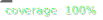
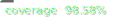
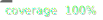
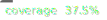
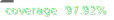
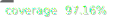

# Koop

*Translate, query, & integrate any geospatial API on the web*

Koop is a JavaScript toolkit for making requests to spatial APIs. It exposes a Node.js web server that faciliates on-the-fly transformations of geospatial data from one format to another and delivers it to clients by HTTP.  Koop allows you to keep your data in its native format, while making it accessible in any format required.  Out-of-the-box, Koop can translates your data into the GeoServices specification supported by ArcGIS products. It's plugin architecture supports output in other formats including vector-tile, WMS, and plain old GeoJSON. Learn more at [https://koopjs.github.io](https://koopjs.github.io).

Koop's plugin-architecture facilates custom deployments specific to your needs. "Provider" plugins to connect to novel data formats and translate to a common format (GeoJSON), while "output" plugins then transform that GeoJSON to other specifications. See a full list of plugins [here](https://koopjs.github.io/docs/available-plugins). If you have a novel datasource or require an as-yet unsupported output format, new plugins can be easily developed and integrated. See the [development section of the Koop docs](https://koopjs.github.io/docs/development).


## Demo
Want to see Koop in action? The repository ships with a demo that shows Koops support for GeoServices (ArcGIS). It leverages the file-geojson data provider and the GeoServices output-plugin:

```bash
git clone https://github.com/koopjs/koop
cd koop
npm run demo
```

Koop will start listening on port 8080. You should the following console logging noting the exposed file-geojson/GeoService routes:

```bash
2023-03-17T19:18:29.416Z info: [Geoservices] routes for [file-geojson] provider
2023-03-17T19:18:29.416Z info: ROUTE | [GET, POST] | /file-geojson/rest/info
2023-03-17T19:18:29.416Z info: ROUTE | [GET, POST] | /file-geojson/tokens/:method
2023-03-17T19:18:29.417Z info: ROUTE | [GET, POST] | /file-geojson/tokens
2023-03-17T19:18:29.417Z info: ROUTE | [GET, POST] | /file-geojson/rest/services/:id/FeatureServer/:layer/:method
2023-03-17T19:18:29.417Z info: ROUTE | [GET, POST] | /file-geojson/rest/services/:id/FeatureServer/layers
2023-03-17T19:18:29.417Z info: ROUTE | [GET, POST] | /file-geojson/rest/services/:id/FeatureServer/:layer
2023-03-17T19:18:29.417Z info: ROUTE | [GET, POST] | /file-geojson/rest/services/:id/FeatureServer
2023-03-17T19:18:29.417Z info: ROUTE | [GET, POST] | /file-geojson/rest/services/:id/FeatureServer*
```

The following request will take the demo data from `demo/provider-data/line.geojson` and send it as geojson:

```
http://localhost:8080/file-geojson/rest/services/line/FeatureServer/0/query
```

Query for features with a specific property value:

```
http://localhost:8080/file-geojson/rest/services/line/FeatureServer/0/query?where=foo='bar'
```

Return data in a different coordinate system:

```
http://localhost:8080/file-geojson/rest/services/line/FeatureServer/0/query?outSR=3857
```

## Koop Monorepo

This repository is home of the Koop monorepo.  In contains a collection of packages that are shipped by default with every Koop instance.  [koop-core](https://github.com/koopjs/koop/packages/core) is the parent package and is used to generate a default configuration of Koop. References to the "Koop version" refer to the version of this package. The other packages in this monorepo are dependencies of core and include the Geoservices output-plugin and its dependencies, the default in-memory data cache, and a logger.  All other plugins (providers, outputs, etc) are in separate repositories.

The Koop dependency graph is shown below.


### Test Coverage
Test coverages for each package are shown below. Coverage for winnow package includes integration tests as opposed to true unit tests. Our goal is to have complete unit test coverage, and breakout integration/e2e tests separately.

| package | integration + unit | unit |
|---|---|---|
|cache-memory|N/A||
|featureserver||
|koop-core|N/A||
|logger|N/A||
|output-geoservices|N/A||
|winnow|||

## Available Plugins

### Providers

Koop uses **providers** to transform data from different sources to GeoJSON.

#### Officially Supported

| name | npm |
| :--- | :--- |
| [ArcGIS Online](https://github.com/koopjs/koop-provider-agol) | [](https://www.npmjs.com/package/koop-agol) |
| [AWS S3 Select](https://github.com/koopjs/koop-provider-s3-select) | [](https://www.npmjs.com/package/@koopjs/provider-s3-select) |
| [Elastic-SQL](https://github.com/koopjs/koop-provider-elastic-sql) | [](https://www.npmjs.com/package/@koopjs/provider-elastic-sql) |
| [File GeoJSON](https://github.com/koopjs/koop-provider-file-geojson) | [](https://www.npmjs.com/package/@koopjs/provider-file-geojson) |
| [GitHub](https://github.com/koopjs/koop-provider-github) | [](https://www.npmjs.com/package/koop-github) |
| [Google Analytics](https://github.com/koopjs/koop-provider-google-analytics) | [](https://www.npmjs.com/package/@koopjs/provider-google-analytics) |
| [Google Sheets](https://github.com/koopjs/koop-provider-google-sheets) | [](https://www.npmjs.com/package/@koopjs/provider-google-sheets) |
| [Marklogic](https://github.com/koopjs/koop-provider-marklogic) | [](https://www.npmjs.com/package/@koopjs/provider-marklogic) |
| [Socrata](https://github.com/koopjs/koop-provider-socrata) | [](https://www.npmjs.com/package/koop-socrata) |

#### Experimental

| name | npm |
| :--- | :--- |
| [American Community Survey](https://github.com/koopjs/koop-acs) | [](https://www.npmjs.com/package/koop-acs) |
| [CKAN](https://github.com/koopjs/koop-provider-ckan) | [](https://www.npmjs.com/package/koop-ckan) |
| [Decennial Census Data](https://github.com/koopjs/koop-census) | [](https://www.npmjs.com/package/koop-census) |
| [GeoCommons](https://github.com/koopjs/koop-geocommons) | [](https://www.npmjs.com/package/koop-geocommons) |
| [Google Fusion Tables](https://github.com/koopjs/koop-provider-google-fusion-tables) | [](https://www.npmjs.com/package/@koopjs/provider-google-fusion-tables) |
| [MongoDB](https://github.com/koopjs/koop-provider-mongo) | |
| [OGC API - Features](https://github.com/koopjs/provider-ogcapi-features) | [](https://www.npmjs.com/package/@koopjs/provider-ogcapi-features) |
| [OpenStreetMap](https://github.com/koopjs/koop-osm) | [](https://www.npmjs.com/package/koop-osm) |
| [Salesforce](https://github.com/Jking-GIS/koop-provider-Salesforce) | [](https://www.npmjs.com/package/koop-salesforce) |
| [Snowflake](https://github.com/Esri/koop-provider-snowflake) | |
| [VRBO](https://github.com/koopjs/koop-vrbo) | [](https://www.npmjs.com/package/koop-vrbo) |
| [Yelp](https://github.com/koopjs/koop-provider-yelp) | [](https://www.npmjs.com/package/koop-yelp) |

#### Third Party

| name | npm |
| :--- | :--- |
| [BigQuery](https://github.com/geobabbler/koop-bigquery-provider) | |
| [Carto](https://github.com/hhkaos/koop-provider-carto) | [](https://www.npmjs.com/package/koop-provider-carto) |
| [Citybikes](https://github.com/nixta/koop-citybikes) | |
| [Cloudant](https://github.com/cloudant/koop-cloudant) | [](https://www.npmjs.com/package/koop-cloudant) |
| [CSV](https://github.com/haoliangyu/koop-provider-csv) | [](https://www.npmjs.com/package/koop-provider-csv) |
| [CSV (ntkog)](https://github.com/ntkog/koop-provider-csv) | [](https://www.npmjs.com/package/@ntkog/koop-provider-csv) |
| [GeoNode](https://github.com/haoliangyu/koop-provider-geonode) | [](https://www.npmjs.com/package/koop-provider-geonode) |
| [OpenDataSoft](https://github.com/haoliangyu/koop-provider-opendatasoft) | [](https://www.npmjs.com/package/koop-provider-opendatasoft) |
| [Postgres/PostGIS](https://github.com/brambow/koop-provider-postgis) | |
| [PostgreSQL/PostGIS (doneill)](https://github.com/doneill/koop-provider-pg) | [](https://www.npmjs.com/package/koop-provider-pg) |
| [ServiceNow](https://github.com/Esri/indoors-servicenow-feature-service) | |
| [Strava](https://github.com/Jking-GIS/koop-provider-Strava) | [](https://www.npmjs.com/package/koop-strava) |
| [Zillow](https://github.com/dmfenton/koop-provider-zillow) | [](https://www.npmjs.com/package/koop-zillow) |

Know of a provider that isn't listed? Please let us know by [submitting an issue](https://github.com/koopjs/koop/issues/new).

---

### Outputs

Koop uses **outputs** to transform GeoJSON from providers into open specification formats.

#### Officially Supported

| name | npm | koop compatibility |
| :--- | :--- | :--- |
| [Geoservices](https://github.com/koopjs/koop-output-geoservices) | [](https://www.npmjs.com/package/koop-output-geoservices) | 3.x |
| [Vector Tiles](https://github.com/koopjs/koop-output-vector-tiles) | [](https://www.npmjs.com/package/koop-output-vector-tiles) | 3.x |

#### Experimental

| name | npm | koop compatibility |
| :--- | :--- | :--- |
| [Flatted JSON](https://github.com/koopjs/koop-output-flat) | | 3.x |
| [OGC API - Features](https://github.com/koopjs/output-ogcapi-features) | [](https://www.npmjs.com/package/@koopjs/output-ogcapi-features) | 3.x |
| [WFS](https://github.com/koopjs/koop-output-wfs) | | 3.x |
| [WMS](https://github.com/koopjs/koop-output-wms) | | 3.x |

#### Third Party

| name | npm | koop compatibility |
| :--- | :--- | :--- |
| [GeoJSON/TopoJSON](https://github.com/haoliangyu/koop-output-geojson) | [](https://www.npmjs.com/package/koop-output-geojson) | 3.x |

---

## Contributing
See our [contribution](./CONTRIBUTING.md) doc.

## Issues
Find a bug or want to request a new feature? Post it [here](https://github.com/koopjs/koop/issues).

## Resources

* [Koop Documentation](https://koopjs.github.io/)
* [ArcGIS REST API Documentation](http://resources.arcgis.com/en/help/arcgis-rest-api/)
* [ArcGIS for Developers](http://developers.arcgis.com)
* [@esri](http://twitter.com/esri)

## License

[Apache 2.0](LICENSE)

<!-- [](Esri Tags: ArcGIS Web Mapping GeoJson FeatureServices) -->
<!-- [](Esri Language: JavaScript) -->
