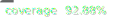

# Koop
[![npm version][npm-img]][npm-url]


> Transform, query, & download geospatial data on the web.  See [koopjs.github.io](https://koopjs.github.io) for details.

This is the core dependency for setting up a Koop instance.  By default it includes the Output-Geoservices plugin and an in-memory data cache.

## Install
```bash
# Install Koop npm and save to package.json
npm install --save @koopjs/koop-core
```

## Usage

The Koop [usage docs](https://koopjs.github.io/docs/usage/koop-core) and [quick start](https://koopjs.github.io/docs/basics/quickstart) provide usage information, but we'll give a quick overview here.

```js
// require koop-core
const Koop = require('@koopjs/koop-core')

// create a Koop instance
const koop = new Koop(options)

/* Register Koop data providers */
const provider = require('@koopjs/provider-github')
koop.register(provider)


// Start listening on port 8080
koop.server.listen(8080, () => console.log(`Koop listening on port 8080!`))
```

Every Koop instance includes the Geoservice output-plugin by default, so after startup noted above, you would have the following routes ready to receive requests:
[GET, POST] /github/rest/info
[GET, POST] /github/rest/services/:id/FeatureServer/:layer/:method
[GET, POST] /github/rest/services/:id/FeatureServer/layers
[GET, POST] /github/rest/services/:id/FeatureServer/:layer
[GET, POST] /github/rest/services/:id/FeatureServer

### Options
You can pass an `options` object when instantiating a Koop instance. 

```js
// create a Koop instance
const koop = new Koop(options)
```

#### disableCors
Koop enables CORS by default.  If you do not want CORS enabled, you can disable it by adding a `disableCors` boolean to your Koop config file:

```js
const options = {
  disableCors: true
}
```

#### disableCompression
Koop adds Express compression by default.  If you do not want Express compression (e.g., perhaps you are using Nginx for compression), you can disable it by adding a `disableCompression` boolean to your Koop config file:

```js
const options = {
  disableCompression: true
}
```

#### logger
Koop includes a Winston logger with a console transport by default.  If you have a custom logger that you want to use, you can pass it as an option:

```js

const logger = require('my-logger')
const options = {
  logger
}
```

#### logLevel
The default Koop logger uses a log-level of `info`.  If you want to change the log level, you can pass any of the standard Winston log-level values as an option:

```js
const options = {
  logLevel: 'debug'
}
```

## Issues

Find a bug or want to request a new feature? Please let us know by submitting an [issue](https://github.com/koopjs/koop/issues).

## Contributing

Esri welcomes contributions from anyone and everyone. Please see our [guidelines for contributing](https://github.com/Esri/contributing).

## License

[Apache 2.0](LICENSE)

<!-- [](Esri Tags: ArcGIS Web Mapping GeoJson FeatureServices) -->
<!-- [](Esri Language: JavaScript) -->

[npm-img]: https://img.shields.io/npm/v/@koopjs/koop-core.svg?style=flat-square
[npm-url]: https://www.npmjs.com/package/@koopjs/koop-core