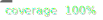

# Koop Geoservices Output Plugin

[![npm version][npm-img]][npm-url]


Wraps FeatureServer into a [Koop](http://koopjs.github.io) Output plugin.

## Usage
```js
const Koop = require('@koopjs/koop-core')
const config = require('config')
const koop = new Koop(config)
const outputGeoservices = require('@koopjs/output-geoservices')
const provider = require('koop-agol') // any koop provider here

// All output plugins must be registered before any providers are registered
koop.register(outputGeoservices)
koop.register(provider)

koop.server.listen(80)
```

## Routes

```js
Geoservices.routes = [
  {
    path: '$namespace/rest/info',
    methods: ['get', 'post'],
    handler: 'featureServerRestInfo'
  },
  {
    path: '$namespace/tokens/:method',
    methods: ['get', 'post'],
    handler: 'generateToken'
  },
  {
    path: '$namespace/tokens/',
    methods: ['get', 'post'],
    handler: 'generateToken'
  },
  {
    path: '$namespace/rest/services/$providerParams/FeatureServer/:layer/:method',
    methods: ['get', 'post'],
    handler: 'featureServer'
  },
  {
    path: '$namespace/rest/services/$providerParams/FeatureServer/layers',
    methods: ['get', 'post'],
    handler: 'featureServer'
  },
  {
    path: '$namespace/rest/services/$providerParams/FeatureServer/:layer',
    methods: ['get', 'post'],
    handler: 'featureServer'
  },
  {
    path: '$namespace/rest/services/$providerParams/FeatureServer',
    methods: ['get', 'post'],
    handler: 'featureServer'
  },
  {
    path: '$namespace/rest/services/$providerParams/FeatureServer*',
    methods: ['get', 'post'],
    handler: 'featureServer'
  },
  {
    path: '$namespace/rest/services/$providerParams/MapServer*',
    methods: ['get', 'post'],
    handler: 'featureServer'
  }
]
```

[npm-img]: https://img.shields.io/npm/v/@koopjs/output-geoservices.svg?style=flat-square
[npm-url]: https://www.npmjs.com/package/@koopjs/output-geoservices